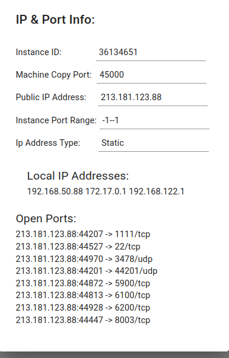
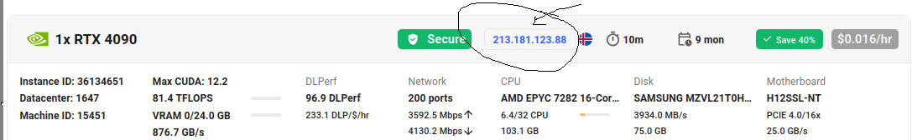
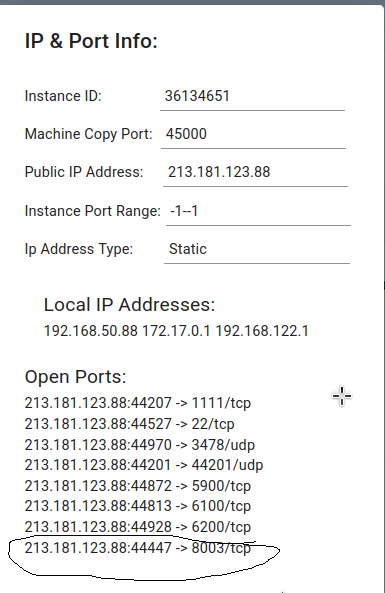

This illustrate how to setup the service3 of fine-tuning the RL model on vast.ai 

Currently, we hosted the service3 on vast.ai using these Ip and port info:

 

But we stopped the service3, for trying it out you can either set it up by launching the service3 on vast.ai and checking the IP and port info on the machine: 
using this template: https://cloud.vast.ai?ref_id=522317&template_id=c84729a80aa51a370eb8dbba78404d52

and using a GPU RTX 4090, 

and run the following steps: 

ssh -p <PORT> user@<IP_ADDRESS>
the <PORT> and <IP_ADDRESS> you can locate the IP and port info by going to 

You will find the PORT and IP_ADDRESS, now locate the public IP address and the port number that maps to 8003 locally 

and put it in the .env file that is available in the route directory of the project (this is useful for letting service1 and 2 connect to service3)

NOTE: Setting up service3 on vast.ai should be done before launching the service1 and service2
After setting up the .env file, you can launch the service1 and service2, and they will be able to connect to service3 on vast.ai using the IP and port info you just set up. FOr more info check the README file in the root directory of the project. 
[README.md](../../README.md)

So commands to launch service3: 
ssh -p <PORT> user@<IP_ADDRESS>

once in the machine

git clone https://github.com/jad-lakkis/RacerHelper-DriverConditionedRL.git

cd RacerHelper-DriverConditionedRL/services/service3

chmod +x 1_setup_tmnf_docker.sh
./1_setup_tmnf_docker.sh
(this takes aroud 10 to 15 minutes to complete)

pip install fastapi uvicorn httpx
    /home/user/.local/bin/uvicorn main:app --host 0.0.0.0 --port 8003

You are good to go ! Enjoy !!! 

Tips: 

You can look at the interface even 
